# vouch

A confabulation gate for LLM agents. When an agent's draft reply contains
an ungrounded factual claim about a named external entity, vouch's Stop
hook blocks the turn and pushes the agent into a **Fetch-Before-Claim**
loop: the agent points vouch at a source URL, vouch fetches and persists
it as a dossier, the agent picks a verbatim quote from that dossier, and
vouch's NLI judge verifies the quote actually supports the claim.

Three pieces, one binary:

- **CLI** (`vouch fetch`, `vouch claim`, ...) — the trust-establishing
  fetcher + NLI verifier + persistent KB.
- **Skill** (`skills/vouch/SKILL.md`) — drops into `~/.claude/skills/` to
  teach the agent the Fetch-Before-Claim workflow.
- **Stop hook** (`vouch gate`) — runs after every assistant turn, scans
  the draft for ungrounded claims, and blocks until each one is grounded
  or hedged.

Without the hook, vouch is an opt-in citation system. With the hook, it's
an enforced one.

## What it does

```
1. Assistant emits draft                  2. Stop hook intercepts
   ─────────                                 ─────────
   "Foo is the leading                     → BLOCKED — ungrounded claim
    framework for X."                        about "Foo" (no candidate
                                             claim in KB)

3. Agent (skill loaded) runs the loop     4. Hook re-checks, unblocks
   ─────────                                 ─────────
   $ vouch search "Foo X"                  → All factual claims now
   $ vouch fetch https://.../foo-docs        carry [verified: id] tags
   $ vouch get-dossier <slug> --full         or are hedged
   $ vouch claim "..." \                   → turn ships
       --source-quote "..."
                          → claim_id 178
```

## Install

vouch ships as three pieces. Install the CLI first; the skill and Stop
hook are optional but together turn vouch from a passive KB into an
enforced gate.

Requires [Bun](https://bun.sh) ≥ 1.3.

### 1. CLI binary

```bash
git clone https://github.com/sunnyadn/vouch
cd vouch
bun install
bun run build              # produces dist/vouch (single binary, ~59MB)
ln -sf "$PWD/dist/vouch" ~/.local/bin/vouch
vouch --version
```

### 2. Claude Code skill

Drop the bundled skill into your Claude Code skills directory:

```bash
cp -r skills/vouch ~/.claude/skills/
```

This loads the agent-side workflow (fetch → read dossier → submit claim
→ tag synthesis). Without it, agents need to be told the loop manually
each session.

### 3. Stop hook

Merge this block into `~/.claude/settings.json` (user-level), or into
`.claude/settings.json` inside a project for project-level scope:

```json
{
  "hooks": {
    "Stop": [
      {
        "hooks": [
          {
            "type": "command",
            "command": "vouch gate --transcript-stdin --strict",
            "timeout": 30,
            "statusMessage": "vouch gate"
          }
        ]
      }
    ]
  }
}
```

If the file already has a `hooks.Stop` array, append the inner `hooks`
entry rather than replacing the block. Drop `--strict` for advisory mode
(gate warns but does not block the turn).

### 4. Optional fetcher CLIs

vouch's `vouch fetch` ships with a built-in generic fetcher that handles
most static URLs. Three external CLIs, when present on `PATH`, broaden
coverage with higher fidelity. All are auto-detected — vouch falls back
to the generic fetcher when any is missing, so none is required.

| CLI | Enables | Install hint |
|---|---|---|
| `gh` | GitHub repos / READMEs / issues fetcher | GitHub CLI from your package manager or its homepage |
| `markitdown` | cleaner HTML→Markdown (otherwise an in-process strip is used) | `pip install markitdown` (or pipx) |
| `opencli` | JS-rendered page fetcher (needs the Chrome browser-bridge extension too) | see the opencli project repo |

`vouch doctor` reports which of these are detected and prints an install
hint for the absent ones, so you can choose what to add post-install.

## Configure

vouch loads env in this order, with later sources overriding earlier ones:

1. `~/.vouch/.env` — the canonical per-user spot (stable across cwd; what
   you want for everyday use, including agent invocations from arbitrary
   directories).
2. `<cwd>/.env` — useful as a per-project override during dev.
3. Real shell environment variables.

Quickstart — copy the example into place and edit:

```bash
mkdir -p ~/.vouch && cp .env.example ~/.vouch/.env
$EDITOR ~/.vouch/.env
```

The variables (see `.env.example` for the full list):

```bash
# Verifier — anything Vercel AI SDK supports. LiteLLM-style provider/model strings.
VOUCH_VERIFIER_MODEL=vertex_ai/gemini-3.1-pro-preview
# VOUCH_VERIFIER_MODEL=openai/gpt-4o
# VOUCH_VERIFIER_MODEL=anthropic/claude-sonnet-4-6

# Embedder — same convention.
VOUCH_EMBEDDER_MODEL=vertex_ai/text-embedding-005
# VOUCH_EMBEDDER_MODEL=openai/text-embedding-3-small

# Vertex (default) — auth via service-account JSON key
GOOGLE_APPLICATION_CREDENTIALS=/path/to/sa-key.json
GOOGLE_CLOUD_PROJECT=your-project-id
GOOGLE_CLOUD_LOCATION=global
```

Defaults assume Vertex Gemini + Vertex `text-embedding-005`. Switch
providers without code changes.

After setting env vars, run `vouch doctor` to verify provider credentials,
DB connectivity, and Stop-hook installation — all pure-local checks, no
API calls. Exits 1 on any failure with actionable fix hints, so it drops
cleanly into CI / setup scripts.

## How agents use it

When the Stop hook detects an ungrounded factual claim in the assistant's
draft, it injects feedback like:

```
[vouch-gate] Detected ungrounded factual claim(s) about named external entities.
  • <Entity>: "<the unverified statement>"
    (no candidate claim in KB)

Before answering, ground each claim:
  • vouch search "<keyword>" — check the KB
  • vouch fetch <url> — pull the source
  • vouch claim "<text>" --type ATOMIC --dossier <slug> --source-quote "..."
Or hedge explicitly with "(unverified, from training memory)" near the claim.
```

Before it blocks, the gate first checks whether the agent **already
retrieved a supporting source this session** — a file read with `Read`, a
page pulled with `WebFetch`, results from `WebSearch`. Those live in the
transcript. If one of them entails the proposition (same NLI judge), the
gate snapshots that content as a dossier, files the claim against it, and
passes — so a claim about something the agent demonstrably saw doesn't
force a redundant re-fetch. Anything the agent only *asserted* (training
memory, paraphrase) still blocks. A `Read` source is recorded with
`scope: workspace`; a `WebFetch` source with `scope: third-party`.

When the gate does block, the agent (with the skill loaded) runs the loop:

1. **Search the KB first** — `vouch search "<keyword>"`. If a relevant
   verified claim already exists, cite its `claim_id` and skip ahead.
2. **Otherwise fetch the source** — `vouch fetch <url>` returns a
   `dossier_slug`; vouch performs the HTTP request itself and persists the
   content. (If the agent already pulled this with `WebFetch` this session,
   it doesn't reach this step — the gate auto-grounds from that. This step is
   for sources the agent hasn't retrieved.)
3. **Read what vouch saved** — `vouch get-dossier <slug> --full`. The
   quote must come from this dossier text, not the agent's own read of
   the URL — HTML strippers differ and the quote-in-dossier check
   rejects mismatches.
4. **Submit the claim** — `vouch claim "<text>" --type ATOMIC --dossier
   <slug> --source-quote "<verbatim>"`. Returns `claim_id`.
5. **Re-emit the response** — tag the grounded claim with
   `[verified: <claim_id>]`, or hedge with `(unverified, from training
   memory)` for claims the agent chose not to ground. Hook re-checks; if
   every factual claim is tagged or hedged, the turn unblocks.

The full agent instructions live in `skills/vouch/SKILL.md` — the
canonical source for the workflow including INFERENCE / SYNTHESIS rules,
supersede semantics, output tagging conventions, and anti-patterns.

## CLI reference

vouch is agent-driven by design, but the CLI is fully usable from a shell
for one-off claims, debugging, or KB inspection.

```bash
# Find a source (KB-first: reuses dossiers/claims you already have; falls
# through to a web search when the KB has no strong match)
vouch search "nginx rate limiting limit_req_zone burst"
# → {"kb_sufficient":false,"kb":[...],"web":[{"title":"...","url":"https://...","snippet":"..."}],
#     "web_provider":"ddg",...}
vouch search "Fine Gray 1999 subdistribution hazard" --provider openalex   # academic index
vouch search "ALCE citation benchmark" --kb-only                            # never web-search

# Fetch — vouch performs the HTTP request itself (the trust boundary) AND
# returns the readable content, so this is a drop-in for a web-fetch tool
vouch fetch https://arxiv.org/abs/2410.05779
# → {"dossier_slug":"evidence/arxiv/...","content":"<first ~8000 chars>","content_chars":68151,...}
vouch fetch <url> --full                # entire content
vouch get-dossier <slug> --offset 8000 --limit 4000   # paged re-read later

# Submit a claim (--source-quote optional: vouch auto-selects a supporting
# passage from the dossier if you omit it)
vouch claim "<text>" --type ATOMIC \
  --dossier <slug> \
  [--source-quote "<verbatim 1–3 sentences from the dossier>"] \
  --topic <topic> --attribution "<authors / org>"
# → {"status":"supported","score":1,"claim_id":1,"quote_match":"exact"}

# Build derived claims (no source step — depends on existing KB claim_ids)
vouch claim "<text>" --type INFERENCE --depends-on 1,2 --topic <topic> --soft-score 0.8

# Browse
vouch list-topics
vouch list-claims --topic <X> --status supported
vouch chain <id>                  # walk dependency DAG

# Self-correct (audit trail preserved)
vouch supersede <old_id> <new_id> --reason "<why>"

# Diagnostics
vouch doctor
```

See `vouch <command> --help` for full flags.

Default DB at `~/.vouch/store.db` (SQLite). Override with `VOUCH_DB_PATH`.

## The research loop

vouch is meant to *be* the agent's research tools, so the dossier a claim
cites is a byproduct of reading the source — not a separate ceremony:

```
vouch search "<question>"          → check KB first; web-fallback if thin
   ↓ pick a result
vouch fetch <url>                  → returns the content AND persists the dossier
   ↓ read, reason
vouch claim "<sentence>" --dossier <slug>   → quote auto-selected; NLI-verified
```

`vouch search` is KB-first: if you already have a dossier (or a supported
claim) covering the query it returns that — no re-fetch. When the KB has no
strong match it web-searches: **DuckDuckGo by default** (general web), or an
academic index with `--provider openalex|pubmed|arxiv|google-scholar` (HTTP,
via [opencli](https://github.com/jackwener/opencli)). Academic indices need
`opencli` on PATH (`bun install -g @jackwener/opencli`; `VOUCH_OPENCLI_BIN`
overrides); the DuckDuckGo default needs nothing.

Notes:
- For academic claims pass `--provider` — PubMed doesn't index pure-statistics
  journals (e.g. JASA), so a stats source needs `openalex` / `google-scholar`.
- `vouch search-citation` and `vouch claim-cite` are **deprecated** aliases of
  this flow (`search --provider` + `fetch` + `claim`); they'll be removed.

## Claim types

| Type | When to use | Required fields |
|---|---|---|
| `ATOMIC` | Direct fact from one source | `--source-url` + `--source-quote` |
| `QUOTATION` | Verbatim quote from one source | `--source-url` + `--source-quote` |
| `SYNTHESIS` | Cross-source statement | `--sources` (JSON array, ≥2) |
| `INFERENCE` | Logical deduction from KB claims | `--depends-on <ids>` |
| `INTERPRETATION` | Reframing a single claim | `--depends-on <id>` |
| `HYPOTHESIS` | Speculation; recorded but not verified | (no source needed) |

ATOMIC / QUOTATION / SYNTHESIS hit the verifier (NLI judge). INFERENCE /
INTERPRETATION / HYPOTHESIS skip NLI but require explicit dependencies or
honest `--soft-score`.

## Architecture

The invariant: vouch is a router, not a notebook. Two forced gates close
the loop — drafts only ship through ⓪ the output gate (`vouch gate`), and
facts only enter the KB through ① the input gate (`vouch fetch` or
`vouch attest`). The agent cannot bypass either.

```mermaid
flowchart TB
    TITLE["<b>vouch — anti-fabrication facts router</b><br/>━━━━━━━━━━━━━━━━━━━━<br/>Two forced gates close the loop<br/>⓪ Output gate (vouch gate) — drafts only ship if grounded<br/>① Input gate (vouch fetch / attest) — facts enter the KB only via these<br/>The agent cannot bypass either"]:::title

    URL["🌐 Third-party URL<br/>arxiv · GitHub · HF · web pages"]:::src
    USR["👤 User's private domain<br/>dated statements · decisions · private docs"]:::src

    DRAFT["📝 Assistant draft<br/>(end of turn)"]:::draft
    GATE0["<b>🚪 ⓪ Output gate (vouch gate)</b><br/>━━━━━━━━━━━━<br/>Stop-hook scans draft for ungrounded<br/>named-entity factual claims<br/>━━━━━━━━━━━━<br/>blocks the turn until each is<br/>grounded with [verified: id] OR hedged"]:::gate
    SHIP["🚢 Turn ships"]:::acc

    AGENT["🤖 LLM agent<br/>(skill-driven Fetch-Before-Claim loop)"]:::agt

    INGATE["<b>⛔ ① Input gate — forced</b><br/>━━━━━━━━━━━━<br/>vouch fetch &lt;url&gt;<br/><i>vouch grabs the bytes itself; the agent never touches them</i><br/>vouch attest &lt;slug&gt;<br/><i>user self-declares, takes responsibility</i><br/>━━━━━━━━━━━━<br/>Facts enter the KB only via these two paths"]:::gate

    STORE[("<b>📚 ③ KB store</b><br/>~/.vouch/store.db<br/>━━━━━━━━━━━━<br/>dossiers · claims<br/>dependency DAG · supersede chain<br/>verification field tags the mode")]:::store

    QC{"<b>② Check 1: quote-in-dossier</b><br/>quote must appear in source<br/>(normalized exact match)"}:::check
    NLI{"<b>② Check 2: NLI judge</b><br/>ATOMIC: quote ⊨ claim<br/>INFERENCE: premises ⊨ conclusion<br/>INTERPRETATION: premise ↔ paraphrase"}:::check
    REJ["❌ Rejected<br/>quote-not-in-dossier<br/>OR unsupported"]:::rej
    ACC["✅ Accepted<br/>verification: nli-quote · entailment · reframing"]:::acc

    OUTPUT["🗣️ claim_id<br/>vouch chain &lt;id&gt; walks the full evidence chain"]:::src

    MAINT["<b>🔁 ④ Active maintenance (v0.4+)</b><br/>━━━━━━━━━━━━<br/>periodic refetch — detect source drift<br/>sleep-time inference — neighborhood INFERENCE candidates<br/>━━━━━━━━━━━━<br/>both feed back into ② verification + ③ store, closing the loop"]:::maint

    TAKEAWAY["<b>Don't rely on prompt self-discipline — rely on pipeline closure</b><br/>vouch is not the agent's notebook.<br/>It is the facts router the agent cannot bypass."]:::takeaway

    TITLE -.-> URL
    URL --> INGATE
    USR --> INGATE
    INGATE --> STORE

    DRAFT --> GATE0
    GATE0 -- "all clean" --> SHIP
    GATE0 -- "ungrounded → block" --> AGENT

    AGENT -- "submits claim<br/>+ quote / premises" --> QC
    STORE -.-> QC
    QC -- "✓" --> NLI
    QC -- "✗" --> REJ
    NLI -- "✓ supported" --> ACC
    NLI -- "✗ unsupported" --> REJ
    ACC --> STORE
    ACC --> OUTPUT

    OUTPUT -- "tag draft with<br/>[verified: id]" --> DRAFT

    STORE <--> MAINT
    MAINT -. "re-verify / candidates" .-> QC

    SHIP -.-> TAKEAWAY

    classDef title fill:#1a237e,stroke:#000,stroke-width:3px,color:#fff
    classDef takeaway fill:#1a237e,stroke:#000,stroke-width:3px,color:#fff
    classDef gate fill:#fff3e0,stroke:#e65100,stroke-width:4px,color:#000
    classDef store fill:#e3f2fd,stroke:#0d47a1,stroke-width:3px,color:#000
    classDef maint fill:#fce4ec,stroke:#ad1457,stroke-width:2px,color:#000
    classDef src fill:#f5f5f5,stroke:#616161,color:#000
    classDef agt fill:#e8eaf6,stroke:#3949ab,stroke-width:2px,color:#000
    classDef rej fill:#ffebee,stroke:#c62828,color:#000
    classDef acc fill:#e8f5e9,stroke:#2e7d32,stroke-width:2px,color:#000
    classDef check fill:#fff8e1,stroke:#f57c00,stroke-width:2px,color:#000
    classDef draft fill:#f3e5f5,stroke:#6a1b9a,color:#000
```



Implementation — single Bun-compiled binary, no daemon, no HTTP:

```
CLI (vouch)
 ├─ bun:sqlite  →  ~/.vouch/store.db  (claims + dossiers + dependency DAG)
 ├─ Vercel AI SDK
 │   ├─ verifier  →  generateObject({ schema: { supported, score, reason } })
 │   └─ embedder  →  embed/embedMany
 └─ commander    →  argparse + JSON output
```

Each invocation opens SQLite, calls the configured provider, returns JSON.
Cold start ~0.5s.

## The "Fetch Before Claim" pattern

The principle: every factual claim in an LLM's output must trace to a
verbatim source quote that *vouch itself fetched* — not invented from
latent knowledge, not hallucinated as a "probably-correct citation", not
copied from a summary. vouch enforces this in three layers:

1. **Trust-establishing fetch.** `vouch fetch <url>` is the primary entry
   point. vouch — not the agent — performs the HTTP request and persists
   the resulting content (markitdown-converted when available, in-process
   strip as fallback). The dossier is the canonical record of what was at
   the URL at fetch time.

2. **Quote-in-dossier check + NLI.** `vouch claim` rejects on two layers:
   - The submitted quote must appear in the fetched dossier content
     (after light normalization for whitespace, smart quotes, punctuation
     spacing). Forged or paraphrased quotes are rejected before reaching
     the verifier.
   - An LLM-as-judge (default Vertex Gemini 3.1 Pro) then verifies the
     claim is supported by the quote. NLI is strict — overshooting the
     quote ("most widely deployed" claimed from a quote that says only
     "is widely deployed") gets rejected.

3. **Self-correction.** `vouch supersede` records corrections with
   reason; both old and new claims stay queryable. The KB grows an audit
   trail.

## Threat model

vouch is honest about what it does and doesn't guarantee:

| Threat | Caught by vouch? |
|---|---|
| Agent invents a quote that isn't in the source | ✅ quote-in-dossier check |
| Agent paraphrases instead of quoting verbatim | ✅ quote-in-dossier check (with light normalization) |
| Agent submits a quote that doesn't actually support its claim | ✅ NLI judge |
| Agent claims more than the quote says (overreach) | ✅ NLI judge — strict by design |
| Agent submits an absent claim ("source does not mention X") incorrectly | ✅ NLI judge with absence prompt |
| Agent submits a real quote out of context | ⚠️ partial — frontier verifier sometimes catches, sometimes not |
| Agent fabricates the URL itself (URL doesn't exist or doesn't say what's claimed) | ❌ vouch fetch errors on bad URLs but trusts whatever returns |
| Agent intentionally games the verifier with trivial-but-supported claims | ❌ no defense; relies on visible audit trail + supersede |
| Source page changes after fetch | ⚠️ source_hash records the fetched state; drift detectable on re-fetch |
| Verifier model itself hallucinates a "supported" verdict | ⚠️ choose stronger verifier; rotate occasionally for high-stakes claims |

**Trust assumption**: vouch's trust boundary is the fetcher. If `vouch
fetch <url>` returns content X, vouch treats X as canonical for that URL
at that time. URL spoofing (fake URL → real-looking content via a
controlled server) is out of scope.

**Non-goal**: cryptographic attestation. vouch is a *discipline-imposing*
record-keeping system, not a notarized fact archive. It makes sloppy
claims hard, not malicious claims impossible. For adversarial scenarios
needing cryptographic guarantees, layer in archive.org submission or
third-party attestation — out of vouch's scope.

## License

MIT.
