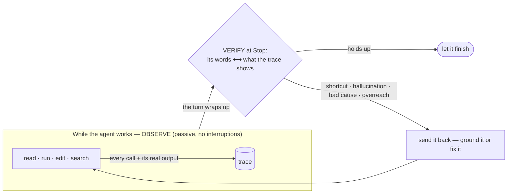

# vouch

**A passive anti-hallucination gate for AI coding agents.** It records everything the
agent *does* — every command, file read, and search — then blocks the moments its words
drift from that: fabricated results, conclusions with no investigation behind them,
*"there's no library for X"* asserted without a search. The agent follows no protocol and
can't forget to use it — the hooks do everything. vouch watches; it doesn't ask.

## How it works, in one loop

vouch **observes** every step while the agent works, then **verifies** its words against
that record when the turn wraps up. There's nothing to cooperate with — the hooks do it all.



## What it catches

| | The agent says… | …but the trace shows | vouch's move |
| --- | --- | --- | --- |
| 🥱 **Shortcut** | "updated **all** the call sites" | 3 files edited, the symbol never grep'd | **block** — search first, or scope it to "the ones I found" |
| 🌫️ **Hallucination** | "there's no library for this" | zero `WebSearch` this session | **block** — search before asserting absence |
| 🔗 **Mis-attribution** | "it failed *because* of the cache, so I disabled it" | the test still fails with the cache off | **block** — the trace doesn't support that cause |
| 🧩 **Overreach** | "no security issues" | two files read | **flag** — scope it to what you actually checked |
| 🔬 **Unfalsifiable** | "this fixes the race condition" | no test that would fail if it *didn't* | **block** — state the test that would refute it, then run it |
| 🧠 **Stale memory** | "as we established, the default is 4 threads" | a file it read earlier says `16` | **block** — contradicts what it saw 40 calls ago |

Every block names the exact span, why it's unsupported, and the fix:

```
⛔ vouch reviewer (BLOCK): [active-fabrication]
   "defaults to 4 threads" — worker.config.ts (read earlier) shows poolSize: 16.
   → re-read the file or correct the number.
```

**[→ How it works](docs/how-it-works.md)** — the mechanism, the two grounding axes, the
two layers (free deterministic gate + agentic LLM reviewer), and what each catch means.

## Install

**Terminal-launched Claude Code only.** Requires [Bun](https://bun.sh) ≥ 1.3.

```bash
# 1 — the CLI, global on your PATH
git clone https://github.com/sunnyadn/vouch && cd vouch
bun install && bun link

# 2 — the reviewer's key
cp .env.example .env     # set ANTHROPIC_API_KEY (+ BASE_URL / VOUCH_REVIEWER_MODEL)
vouch doctor             # confirm the key, endpoint, and a live round-trip
```

```text
# 3 — the hooks (the repo is its own marketplace)
/plugin marketplace add /path/to/this/repo
/plugin install vouch@vouch       # then restart the session
```

**[→ Configuration](docs/configuration.md)** — DeepSeek / kimi gateways, model choice, the
`VOUCH_REVIEWER_OFF` switch, and what each `vouch doctor` check means (and why a quiet vouch
might be a dead one).

## Develop

```bash
bun test
bun run lint
```
